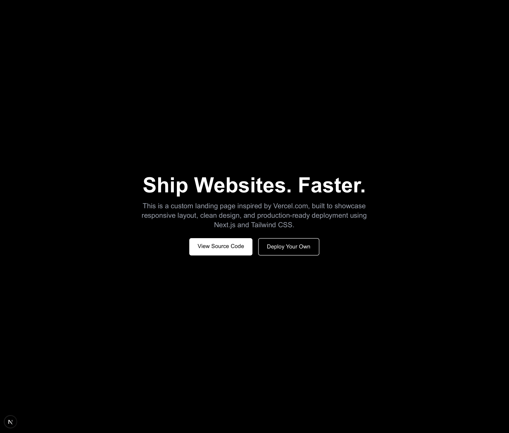

**Vercel-Inspired Landing Page Clone**

This project is a custom landing page inspired by the sleek and responsive design of Vercel.com. It was built to showcase my ability to replicate production-grade frontend layouts using Next.js, Tailwind CSS, and TypeScript. 

**Live Demo**
https://vercel-landing-clone-two.vercel.app

**Tech Stack**
**Framework** 
Next.js (App Router, TypeScript)
**Styling**
Tailwind CSS
**Build Tools**
ESLint, Prettier
**Deployment**
Vercel

**Features**
* Pixel-perfect clone of the Vercel.come hero section
* Fully responsive across mobile, tablet, and desktop
* Clean semantic HTML structure using React components
* Utility-first styling using Tailwind
* Ready for production deployment

**Preview**

**What I Learned**
* Structuring scalable components in a Next.js app
* Rapid design workflow using Tailwind
* Deploying with Vercel
* Writing clean, readable frontend code

**Getting Started**
To run this project locally:
    git clone https://github.com/vivimvivim/vercel-landing-clone.git
    cd vercel-landing-clone
    npm install
    npm run dev
Visit http://localhost:3000 to view it live on your machine.

**Contact**
Vannessa Morrison
📍 Alberta, Canada
📧 morrisonvannessa@gmail.com
🔗 GitHub: vivimvivim

> *"Move quitely. Build powerfully."* 